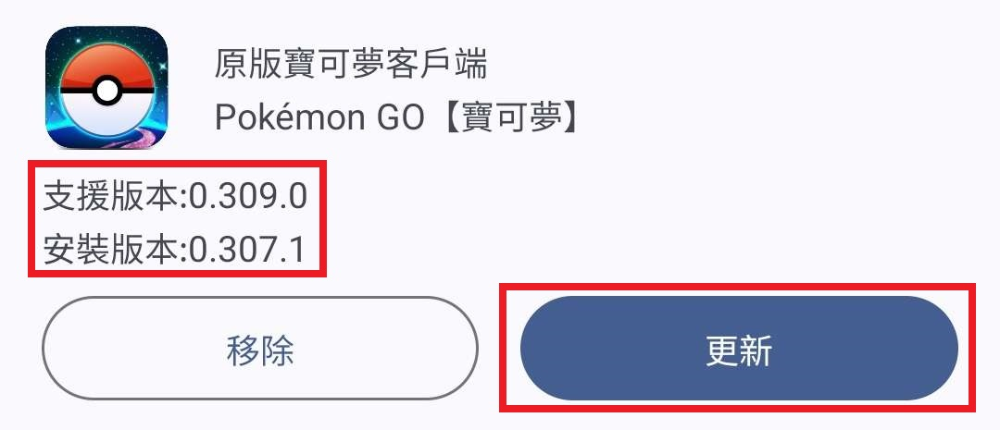

# POGO寶可夢外掛管理器 POGOManager

## 介紹
POGO寶可夢外掛管理器是一個可以管理多個寶可夢外掛的管理器，可以讓你更方便的管理你的寶可夢外掛，並且可以自動更新外掛

## 安裝
本APP只能在Android系統上運行，並且需要Android 7.0以上的系統才能運行
### 下載連結
- [點擊下載](https://www.mediafire.com/file/5mdun6u78jr96rw/app-debug.apk/file)
- [Github下載](https://github.com/lokey0905/POGO_Manager/releases)

## 更新寶可夢與自動抓
- 如果安裝版本低於支援版本，表示需要更新自動抓與寶可夢，請點擊更新按鈕，並且等待更新完成

- 如果寶可夢版本過高，表示可能被play商店自動更新了，關閉方法商店搜尋寶可夢，右上角三個點自動更新取消打勾，若無顯示重啟商店後即可關閉，之後先移除寶可夢，再到下載頁面下載支援版本的寶可夢

- 如果遇到強制更新，可以先到設定中啟用測試版自動抓開關，然後再到下載頁面下載測試版的寶可夢與自動抓，若還是不支援請等待自動抓團隊更新

# 建議玩法
## 手動玩
- 搖桿設定單一位置+Polygon 暴力功+PokeList/WeCatch
- 可以搭配PokeList/WeCatch篩選寶可夢，與Polygon 暴力功的顯示三圍與偵測色違功能

## 單純掛機
- 搖桿設定路線+Pgtools
- 須注意掛機時間，時間太長可能會達到帳號當日上限，甚至軟體鎖

## 掛機刷星辰
- 搖桿設定路線+wrapper+Pgtools 自動抓刷火箭隊(須付費版本)
- 搖桿設定路線+wrapper+Polygon 暴力功半自動刷火箭隊(免費但須手動點擊)
- 須注意掛機時間，時間太長可能會達到帳號當日上限，甚至軟體鎖

# 外掛列表
## GPS Joystick 搖桿改定位 
可以讓你在遊戲中使用搖桿來移動你的位置，並且可以設定路徑移動與移動速度

### 預先設定

修正GPS跳轉到真正的位置

設定中關閉【啟用間接模擬】選項

### 權限與設定
允許顯示於上方懸浮權限與模擬定位應用程式為搖桿

### 匯入GPX路徑檔案
先到管理器內下載路徑zip檔案，下載後解壓縮，選擇匯入GPX檔案並轉換成路徑檔即可

- [資料來源](https://drive.google.com/drive/u/0/folders/1iz4vnBLGwNq-3qishs-RkCuGMkoGeMEQ?sort=13&direction=a&fbclid=IwAR2BpvMIhlf-Awr6kku54O5kwk5F6Cd7k5b6QU7seMaXw-snf1cf03wrRhM)

### 啟動搖桿
點右上角的圖示可切換模式選擇，可以選擇使用單一位置或是路徑移動
- 單一位置: 點擊地圖上的位置或是輸入經位度，按下開始後移動到該位置

 

- 路徑移動: 點擊地圖上的設置路徑，在選擇生成或是加載路徑，按下開始後就會依照路徑位置移動

 

**三星Android 10以上在快捷欄中請不要按這按鈕，可能會導致搖桿崩潰，須重啟搖桿才能正常使用**

### 冷卻時間
搖桿內地圖可察看冷卻剩餘時間，三星用戶請勿直接點擊懸浮的地圖按鈕，會導致搖桿崩潰，請直接開啟搖桿APP內的地圖

其他冷卻說明，可參考下方冷卻計算

## GPS Joystick Wrapper 
可以快速尋找火箭隊的軟體

### 使用
點擊左上角的▶按鈕即可開始尋找火箭隊，點擊⏩按鈕尋找下一個目標，以此類推，需搭配GPS Joystick搖桿使用

## Polygon 暴力功 
可以用來顯示寶可夢IV三圍、偵測色違；自動E球、半自動轉補給站、火箭隊直接勝利等功能

**本軟體不適用:32位元裝置,雙開版本(小米應用雙開,island),三星版本寶可夢**

### 權限與設定
允許顯示於上方懸浮權限與ROOT超級使用者權限(請先關閉其他懸浮APP 否則無法允許權限)

### 使用
輸入KEYS金鑰後，點擊START或是啟動即可開始使用，大部分功能皆以預先設定完成 

功能如下(可在一般設定中查看):

進階設定不建議自行設定，可能會導致不可預知的後果

### 使用點擊傳送功能
請在暴力功的一般設定中，啟用點擊傳送功能，並選擇模擬定位應用程式為Polygon 暴力功

若要將定位切換回搖桿，請在暴力功的一般設定中，關閉點擊傳送功能，並選擇模擬定位應用程式為GPS Joystick 搖桿

定位功能 搖桿與暴力功只能二選一，不能同時使用

## Pgtools 自動抓 
可以自動掛機抓寶可夢，並且可以自動轉補給站等功能

**本軟體不適用:32位元裝置,雙開版本(小米應用雙開,island),三星版本寶可夢**

### 權限與設定
啟動後，需要先允許ROOT超級使用者權限(請先關閉其他懸浮APP 否則無法允許權限)

進入後，點選右上角地圖圖示，可將語言切換成中文

### 使用
第一次進入會顯示一個new script的對話框，這是更新腳本的功能，點下載按鈕即可

若要啟動，點選中間的開始掛機按紐即可啟動

可以自行開關需要的功能，部分功能可能需要付費

若有發生無限重啟的狀況，可以嘗試重新啟動手機

## PokeList 寶可夢列表 
可用來追蹤寶可夢

### 權限與設定
允許顯示於上方懸浮權限與允許定位權限

### 使用
點擊左邊的啟動服務按鈕或是start service即可開始使用，點擊選項即可跳轉位置

### 自動追擊
點擊右上角三個點的自動狙擊，啟動自動狙擊在允許通知存取權限，啟動後會自動狙擊附近的寶可夢

自動點擊功能需搭配Polygon 暴力功的付費功能使用

## WeCatch 寶可夢地圖 
可用來追蹤寶可夢

### 權限與設定
允許定位權限

### 使用
點擊下方五個按鈕執行相關功能

# 飛人基本常識
有效動作：完成捕抓寶可夢動作（逃跑或成功捕獲）、丟球、攻塔 、佔塔、翻塔牌。在上述情形下皆算有效動作。

本段資訊來源: [飛人基本常識](https://www.facebook.com/groups/110722022999876/permalink/600848313987242/?mibextid=Nif5oz)

## 冷卻計算
已做出「有效動作」的前提下，跨國度的冷卻時間，一律就是兩小時。即使是同國度，也請考量進國土疆域大小問題。

如果無法自行判斷，可多多利用相關工具網站：「直線距離計算機」來做最終確認。冷卻時間起算，請依據「該帳號」冒險筆記最後一筆「有效動作」紀錄。

**攻打、佔領道館並不會主動記載於冒險筆記，所以本身如果是多帳玩家，可以養成在要關閉遊戲前，轉個牌或捉隻路邊怪，好讓冒險筆記替你紀錄的習慣。如果一時忘記正在冷卻，而不小心做出了有效動作，冷卻時間並不需重新算起。但請記得，這種異常情形在官方偵測機制當中，次數如果一多，仍是有很大的機率會收到黑函，或是暫時鎖帳。**

**無國界打法：除了進場挑戰頭目，無論參戰前後，皆不做出任何有效動作。在完成挑戰，領取獲勝獎勵後、確認頭目並非自己想捕獲的，可直接離開捕抓畫面，飛往下一個團戰道館，重複上述行為。**

## 卡怪技巧
帳號在冷卻期間，欲捕抓自己喜愛野生100iv野生寶可夢時，就能使用卡怪動作，將怪留至冷卻時間已足夠時，再行捕捉動作。

### 操作方式：
點選欲捕捉的寶可夢，在進入捕捉畫面後，關閉網路，或是開啟飛航模式，然後不再觸碰遊戲畫面。直至冷卻時間確認後，再開啟網路，或是關閉飛航模式。接著等到捕捉畫面左上角，偵測GPS穩定度的圈圈不再頻繁出現時，就能開始進行捕捉寶可夢的動作。

卡怪成功，並不就代表最終一定能捕獲成功。卡怪動作，非常考驗手機效能穩定度，所以如果不能確定自己的手機適不適合卡怪，其實可以先試驗卡幾次的普通怪，做為效能確認。

## 關於VIP邀請函
獲得方式：依循遊戲常規，每星期都會發放一次VIP邀請函。在此次邀請函發送日往前涵括一星期內，曾經於VIP道館挑戰頭目過，才會有一定機率抽中VIP邀請函。

邀請函所顯示的邀請參戰時間，請依自己手機的時間為準。切勿自行換算時間。票面時間會因為擅改時區而隨著更改。